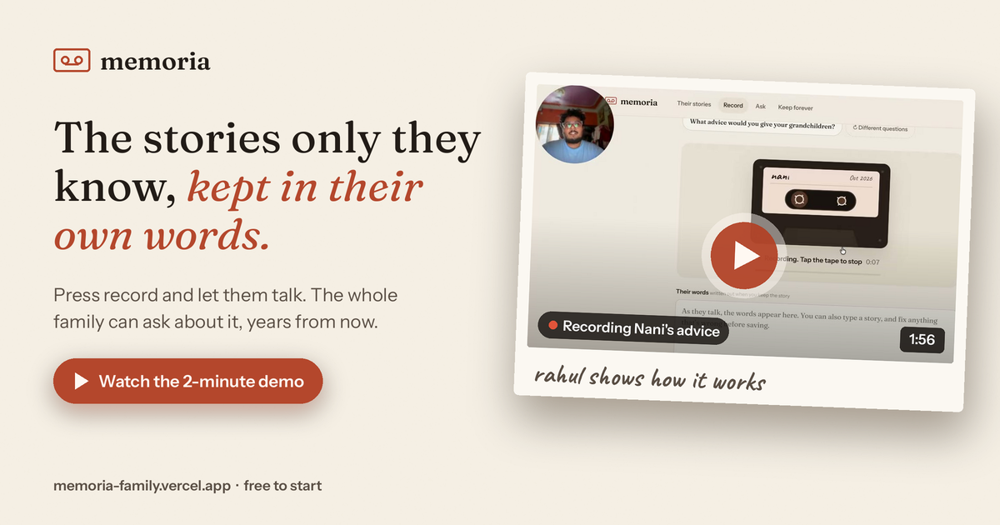

# Memoria

**The stories only they know, kept in their own words.**

Press record and let them talk. Memoria writes it down word for word, keeps the real recording,
and lets the whole family ask about it years from now, then hear them say the answer.

**Live:** https://memoria-family.vercel.app · **Demo (2 min):** https://youtu.be/n9L1O6QPaQo



## What it does

- **Record** on a cassette-style recorder, in any language. Scribe writes it out word for word, with the timing of every word.
- **Their album** files each story with a title and a year, on a timeline of their life.
- **Ask** "how did Nani make the dal?" and get an answer drawn only from what she said, with her exact words underneath.
- **Hear her say it.** Each answer can play the exact moment in the recording where she said those words. Listen only ever plays the real recording; Memoria never generates anyone's voice.
- If they never talked about it, Memoria says so, and offers to record that story next.

## Stack

| Part | What |
|---|---|
| Open models | Gemma 4 (31B, with 26B as a fast fallback) through Backboard, which also keeps each person's memory; a Qwen 3.6 checkpoint on Tinker as the backup model |
| Transcription | ElevenLabs Scribe, word-level timestamps |
| App | Node + Express on Render; static frontend on Vercel |
| Data | Neon Postgres (families, stories, recordings, analytics events) |
| Payments | Dodo Payments, one-time Lifetime ($19) via a signed webhook |
| Analytics | Memoria Pulse, a separate app reading read-only views (`src/pulse.sql`) |

## Plans

| | Free | Lifetime ($19 once) |
|---|---|---|
| People | 1 | Unlimited |
| Stories | 15 | Unlimited |
| Recording length | 10 min | 30 min |
| Real-voice playback, Ask, download | ✓ | ✓ |
| Printable keepsake book | | ✓ |

## Running it locally

```bash
cp .env.example .env    # DATABASE_URL is required; every partner key is optional
npm install
npm run dev             # http://localhost:3000
```

Without partner keys, Memoria falls back to the browser's live transcript and simple rules, so it always works.

## Privacy and security

Each family has a private space opened by a secret link, and only that family can read its stories.
Recordings play through signed links that expire. See [SECURITY.md](SECURITY.md) to report a vulnerability.

## Contributing

Ideas and fixes are welcome. Read [CONTRIBUTING.md](CONTRIBUTING.md) first; `main` is protected and every change goes through a reviewed pull request.

## License

[AGPL-3.0](LICENSE). You're free to use, study and improve Memoria. If you run a modified version as a service, you have to share your changes under the same license.

Made by [Rahul Pandey](https://x.com/rahulpandey187) · [LinkedIn](https://www.linkedin.com/in/rahulpandey187) · [DEV](https://dev.to/talkyrahulrp)
